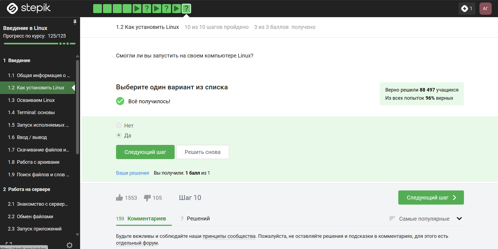
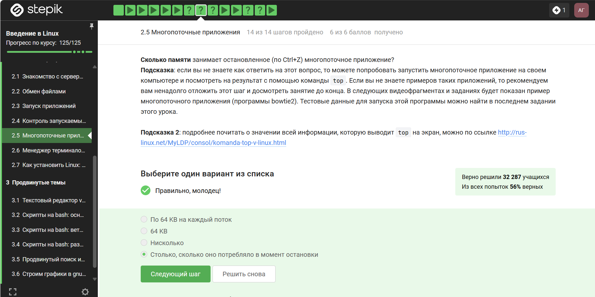
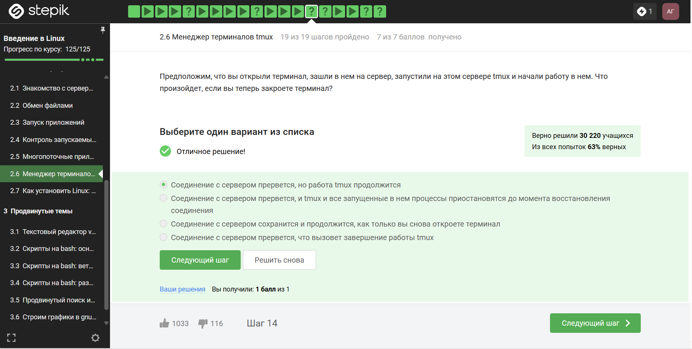
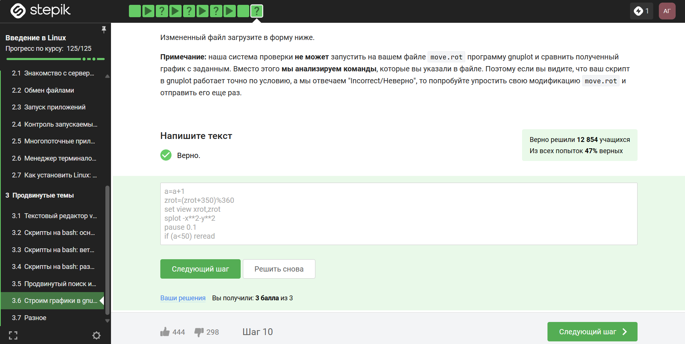

---
## Front matter
title: "Отчет о прохождении внешнего курса"
author: "Гомазкова Алина НКАбд-02-23"

## Generic otions
lang: ru-RU
toc-title: "Содержание"

## Bibliography
bibliography: bib/cite.bib
csl: pandoc/csl/gost-r-7-0-5-2008-numeric.csl

## Pdf output format
toc: true # Table of contents
toc-depth: 2
lof: true # List of figures
lot: true # List of tables
fontsize: 12pt
linestretch: 1.5
papersize: a4
documentclass: scrreprt
## I18n polyglossia
polyglossia-lang:
  name: russian
  options:
	- spelling=modern
	- babelshorthands=true
polyglossia-otherlangs:
  name: english
## I18n babel
babel-lang: russian
babel-otherlangs: english
## Fonts
mainfont: PT Serif
romanfont: PT Serif
sansfont: PT Sans
monofont: PT Mono
mainfontoptions: Ligatures=TeX
romanfontoptions: Ligatures=TeX
sansfontoptions: Ligatures=TeX,Scale=MatchLowercase
monofontoptions: Scale=MatchLowercase,Scale=0.9
## Biblatex
biblatex: true
biblio-style: "gost-numeric"
biblatexoptions:
  - parentracker=true
  - backend=biber
  - hyperref=auto
  - language=auto
  - autolang=other*
  - citestyle=gost-numeric
## Pandoc-crossref LaTeX customization
figureTitle: "Рис."
tableTitle: "Таблица"
listingTitle: "Листинг"
lofTitle: "Список иллюстраций"
lotTitle: "Список таблиц"
lolTitle: "Листинги"
## Misc options
indent: true
header-includes:
  - \usepackage{indentfirst}
  - \usepackage{float} # keep figures where there are in the text
  - \floatplacement{figure}{H} # keep figures where there are in the text
---

# Цель работы

Ознакомиться с функционалом операционной системы Linux.

# Теоретическое введение

Линукс - в части случаев GNU/Linux — семейство Unix-подобных операционных систем на базе ядра Linux, включающих тот или иной набор утилит и программ проекта GNU, и, возможно, другие компоненты. Как и ядро Linux, системы на его основе, как правило, создаются и распространяются в соответствии с моделью разработки свободного и открытого программного обеспечения. Linux-системы распространяются в основном бесплатно в виде различных дистрибутивов — в форме, готовой для установки и удобной для сопровождения и обновлений, — и имеющих свой набор системных и прикладных компонентов, как свободных, так и проприетарных. 

# Выполнение лабораторной работы

1 Этап: (рис. @fig:001, @fig:002, @fig:003, @fig:004, @fig:005, @fig:006, @fig:007, @fig:008, @fig:009, @fig:010, @fig:011, @fig:012, @fig:013, @fig:014, @fig:015, @fig:016, @fig:017, @fig:018, @fig:019, @fig:020, @fig:021, @fig:022, @fig:023, @fig:024, @fig:025, @fig:026, @fig:027, @fig:028, @fig:029).

Курс действительно называется "Введение в Linux", поэтому с этим вопросом проблем не возникло.

{#fig:001 width=70%}

Прочитав критерии прохождения курса, я отметила необходимые утверждения.

{#fig:002 width=70%}

Стандартная операционная система, предлагаемая большей частью магазинов - windows, именно она стоит у меня на основном компьютере.

{#fig:003 width=70%}

На свой компьютер мы устанавливали специальную программу VirtualBox, которая нужна для подключения одной операционной на другой.

{#fig:004 width=70%}

Да, моя виртуальная машина хорошо работает, и у меня получилось запустить с неё Линукс, но в последнее время я чаще использую ноутбук, на котором Линукс стоит как основная операционная система.

{#fig:005 width=70%}

Я создала документ, и перед сохранением выбрала нужный формат, а после я ег прикрепила к курсу. Прикрепленный файл видно на скриншоте.

{#fig:006 width=70%}

deb — формат пакетов операционных систем проекта Debian. Используется также их производными, такими как Ubuntu, Knoppix и другими.

{#fig:007 width=70%}

Здесь на скриншоте видно, что установив программу медиапроигрывателя я посмотрела, кто авторы программы и записала первую фамилию.

{#fig:008 width=70%}

Менеджер обновлений — это программа для обновления установленного программного обеспечения в дистрибутивах ОС Linux, основанных на Debian или использующих систему управления пакетами APT. Менеджер обновлений устанавливает обновления безопасности или просто улучшающие функциональность программы.

{#fig:009 width=70%}

Ассоль - героиня литературного произведения, а термин - это определение.

{#fig:010 width=70%}

Интерфейс командной строки Linux является регистрозависимым.

{#fig:011 width=70%}

{#fig:012 width=70%}

{#fig:013 width=70%}

{#fig:014 width=70%}

{#fig:015 width=70%}

{#fig:016 width=70%}

{#fig:017 width=70%}

{#fig:018 width=70%}

{#fig:019 width=70%}

{#fig:020 width=70%}

{#fig:021 width=70%}

{#fig:022 width=70%}

{#fig:023 width=70%}

{#fig:024 width=70%}

{#fig:025 width=70%}

{#fig:026 width=70%}

{#fig:027 width=70%}

{#fig:028 width=70%}

{#fig:029 width=70%}

2 Этап: (рис. @fig:030, @fig:031, @fig:032, @fig:033, @fig:034, @fig:035, @fig:036, @fig:037, @fig:038, @fig:039, @fig:040, @fig:041, @fig:042, @fig:043, @fig:044, @fig:045, @fig:046, @fig:047, @fig:048, @fig:049, @fig:050, @fig:051, @fig:052, @fig:053).

{#fig:030 width=70%}

{#fig:031 width=70%}

{#fig:032 width=70%}

{#fig:033 width=70%}

{#fig:034 width=70%}

{#fig:035 width=70%}

{#fig:036 width=70%}

{#fig:037 width=70%}

{#fig:038 width=70%}

{#fig:039 width=70%}

{#fig:040 width=70%}

{#fig:041 width=70%}

{#fig:042 width=70%}

{#fig:043 width=70%}

{#fig:044 width=70%}

{#fig:045 width=70%}

{#fig:046 width=70%}

{#fig:047 width=70%}

{#fig:048 width=70%}

{#fig:049 width=70%}

{#fig:050 width=70%}

{#fig:051 width=70%}

{#fig:052 width=70%}

{#fig:053 width=70%}

3 Этап: (рис. @fig:054, @fig:055, @fig:056, @fig:057, @fig:058, @fig:059, @fig:060, @fig:061, @fig:062, @fig:063, @fig:064, @fig:065, @fig:066, @fig:067, @fig:068, @fig:069, @fig:070, @fig:071, @fig:072, @fig:073, @fig:074, @fig:075, @fig:076, @fig:077, @fig:078, @fig:079, @fig:080, @fig:081, @fig:082, @fig:083, @fig:084, @fig:085, @fig:086).

{#fig:054 width=70%}

{#fig:055 width=70%}

{#fig:056 width=70%}

{#fig:057 width=70%}

{#fig:058 width=70%}

{#fig:059 width=70%}

{#fig:060 width=70%}

{#fig:061 width=70%}

{#fig:062 width=70%}

{#fig:063 width=70%}

{#fig:064 width=70%}

{#fig:065 width=70%}

{#fig:066 width=70%}

{#fig:067 width=70%}

{#fig:068 width=70%}

{#fig:069 width=70%}

{#fig:070 width=70%}

{#fig:071 width=70%}

{#fig:072 width=70%}

{#fig:073 width=70%}

{#fig:074 width=70%}

{#fig:075 width=70%}

{#fig:076 width=70%}

{#fig:077 width=70%}

{#fig:078 width=70%}

{#fig:079 width=70%}

{#fig:080 width=70%}

{#fig:081 width=70%}

{#fig:082 width=70%}

{#fig:083 width=70%}

{#fig:084 width=70%}

{#fig:085 width=70%}

{#fig:086 width=70%}

# Окончание прохождения курса. Сертификат

{fig:087 width=70%}

{#fig:088 width=70%}

# Выводы

По окончании курса я освежила в памяти навыки работы с более сложными командами в Линукс,архивами,скачивание команд и тп. 
