---
## Front matter
lang: ru-RU
title: Лабораторная работа №4
subtitle: Использование git
author:
  - Гомазкова А. 
institute:
  - Российский университет дружбы народов, Москва, Россия
  - Объединённый институт ядерных исследований, Дубна, Россия

## i18n babel
babel-lang: russian
babel-otherlangs: english

## Formatting pdf
toc: false
toc-title: Содержание
slide_level: 2
aspectratio: 169
section-titles: true
theme: metropolis
header-includes:
 - \metroset{progressbar=frametitle,sectionpage=progressbar,numbering=fraction}
 - '\makeatletter'
 - '\beamer@ignorenonframefalse'
 - '\makeatother'
---

# Цель работы

Получение навыков правильной работы с репозиториями git.

# Задание

 1. Выполнить работу для тестового репозитория.
 
 2. Преобразовать рабочий репозиторий в репозиторий с git-flow и conventional commits.

# Выполнение лабораторной работы

# Выполняю работу для тестового репозитория

## Установка из коллекции репозиториев Copr

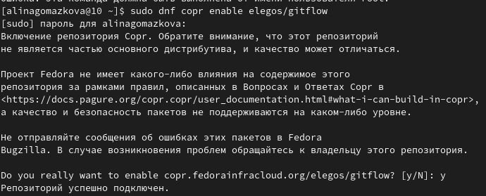{#fig:001 width=70%}

##

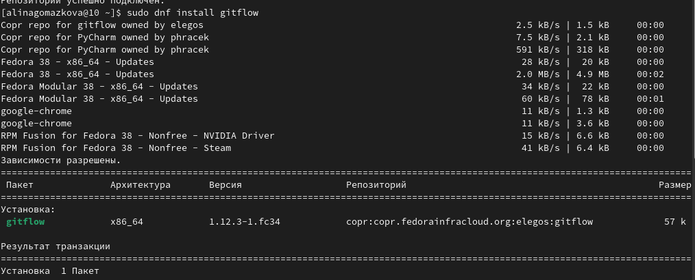{#fig:002 width=70%}

## Установка Node.js

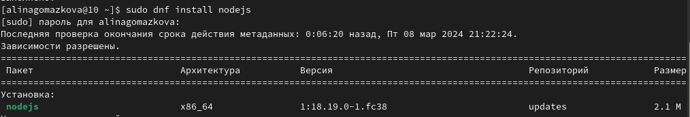{#fig:003 width=70%}

## Установка pnpm 

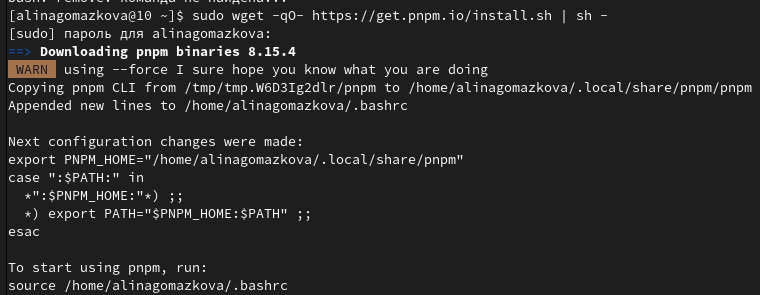{#fig:004 width=70%}

## Запустила pnpm и перелогинилась

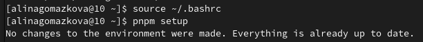{#fig:005 width=70%}

## Добавили программу для помощи в форматировании коммитов

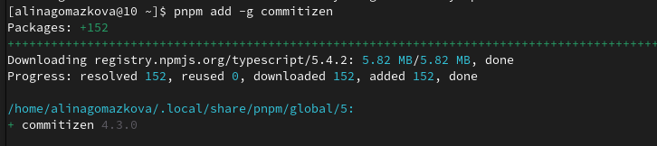{#fig:006 width=70%}

## Добавили программу которая используется для помощи в создании логов

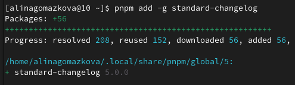{#fig:007 width=70%}

## Создали новый репозиторий "git-extended" и скопировали его адрес 

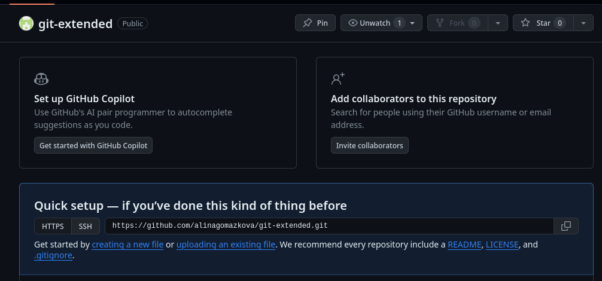{#fig:008 width=70%}

## Клонировали новый репозиторий на устройство и создали файл "README.md" 

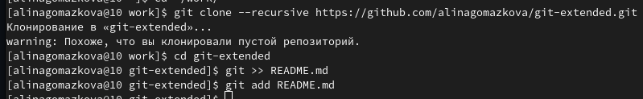{#fig:009 width=70%}

## Делаем первый коммит и выкладываем на github 

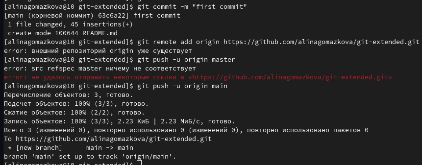{#fig:010 width=70%}

## Создали конфигурация для пакетов Node.js 

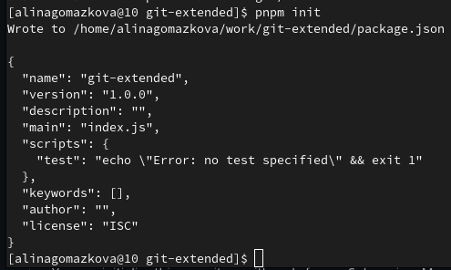{#fig:011 width=70%}

## Заполнила несколько параметров пакета

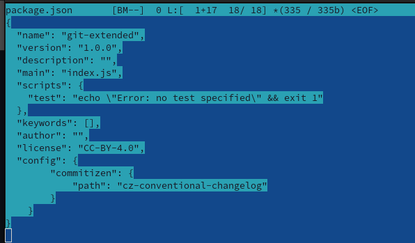{#fig:012 width=70%}

## Добавила новые файлы, сделала коммит и отправила на gitgub

{#fig:013 width=70%}

## 

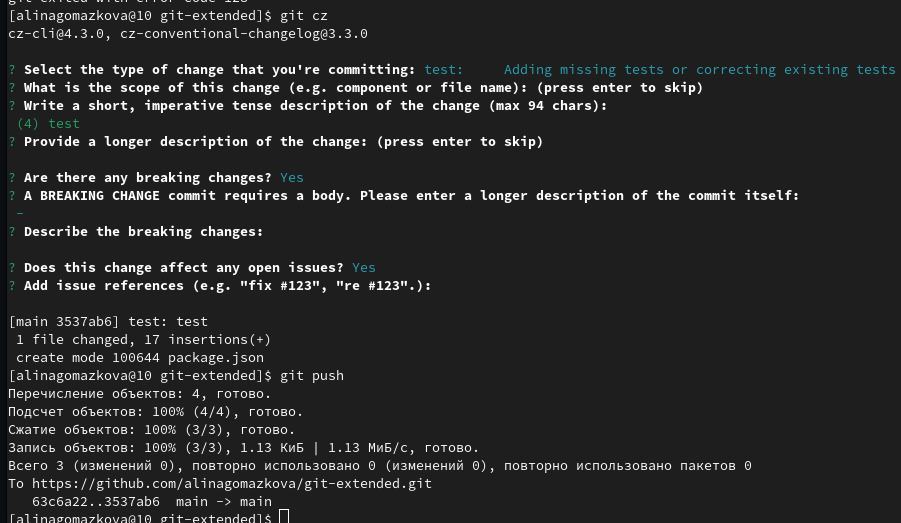{#fig:014 width=70%}

## Инициализировала git-flow,проверила что я на ветке develop 

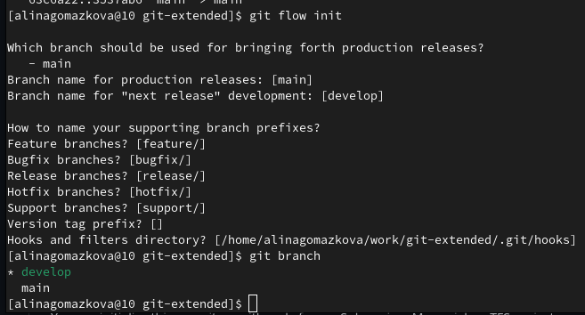{#fig:015 width=70%}

## Загрузила весь репозиторий в хранилище, установила внешнюю ветку как вышестоящую для этой ветки и создадим релиз с версией 1.0.0 

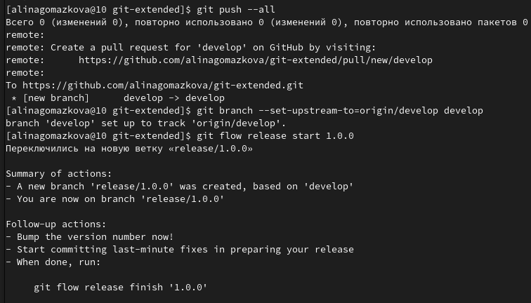{#fig:016 width=70%}

## Создала журнал изменений, добавила журнал изменений в индекс и залила релизную ветку в основную ветку

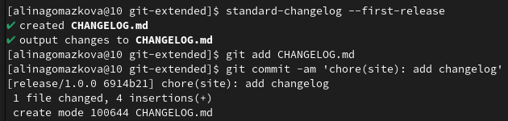{#fig:017 width=70%}

##

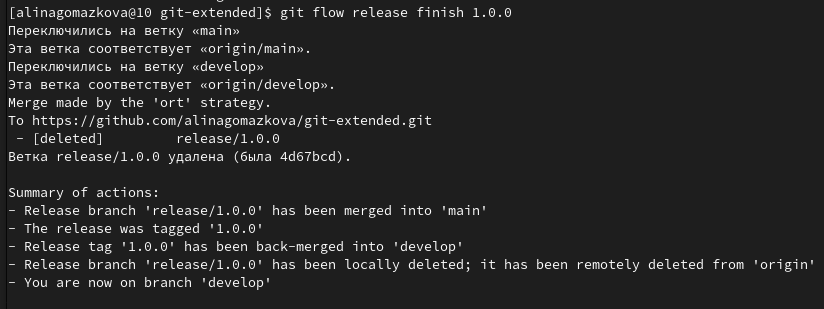{#fig:018 width=70%}

## Отправила данные на github и создала релиз на github 

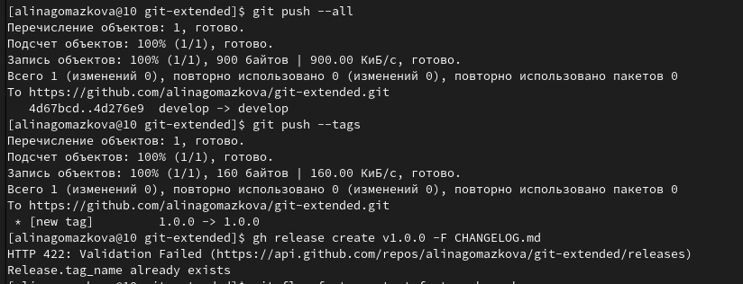{#fig:019 width=70%}

# Преобразовала рабочий репозиторий в репозиторий с git-flow и conventional commits 

## Создала ветку для новой функциональности и по окончании разработки новой функциональности объединила ветку

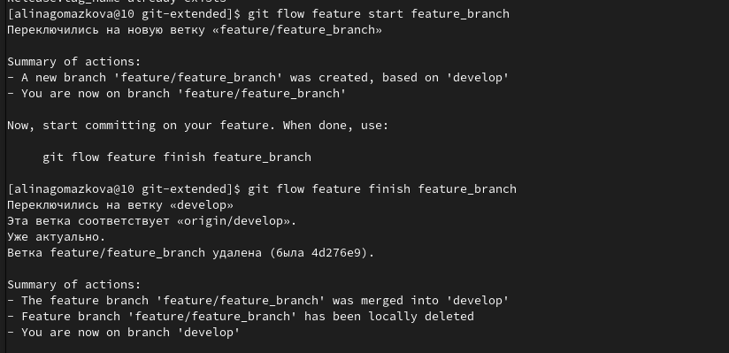{#fig:020 width=70%}

## Создала релиз с версией 1.2.3, создала журнал изменений и добавила журнал изменений в индекс

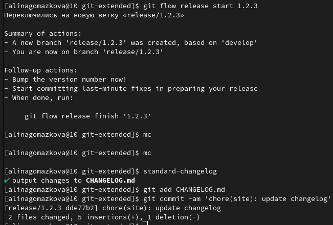{#fig:021 width=70%}

## Обновила номер версии в файле package.json. Установила её в 1.2.3 

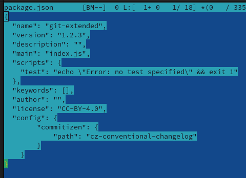{#fig:022 width=70%}

## Залила релизную ветку в основную ветку 

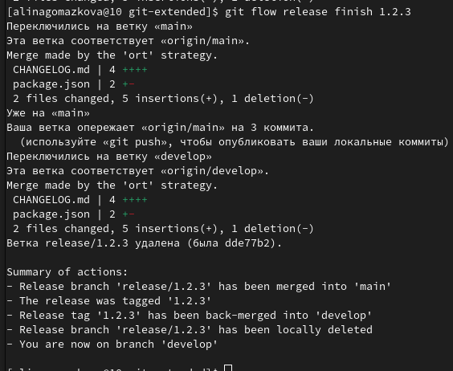{#fig:023 width=70%}

## Отправила данные на github и создала релиз на github с комментарием из журнала изменений

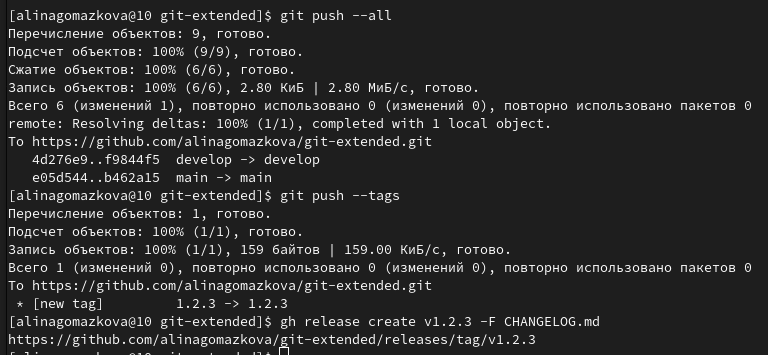{#fig:024 width=70%}

# Вывод

Получил навыки правильной работы с репозиториями git.