---
## Front matter
lang: ru-RU
title: Этап индивидуального проекта №3
subtitle: Операционные системы
author:
  - Гомазкова А.
institute:
  - Российский университет дружбы народов, Москва, Россия

date: 06 апреля 2024

## i18n babel
babel-lang: russian
babel-otherlangs: english

## Formatting pdf
toc: false
toc-title: Содержание
slide_level: 2
aspectratio: 169
section-titles: true
theme: metropolis
header-includes:
 - \metroset{progressbar=frametitle,sectionpage=progressbar,numbering=fraction}
 - '\makeatletter'
 - '\beamer@ignorenonframefalse'
 - '\makeatother'
---

# Информация

## Докладчик

:::::::::::::: {.columns align=center}
::: {.column width="70%"}

  * Гомазкова Алина
  * студентка из группы НКАбд-02-23
  * Факультет физико-математических и естественных наук
  * Российский университет дружбы народов
  * [1032235008@rudn.ru](mailto:1032235008@rudn.ru)
  * <https://alinagomazkova.github.io>

:::
::: {.column width="30%"}

:::
::::::::::::::

## Цель работы

Продолжить работы со своим сайтом. Редактировать его в соответствии с требованиями. Добавить данные о своих достижениях.

## Задание

1. Добавить информацию о навыках (Skills).
2. Добавить информацию об опыте (Experience).
3. Добавить информацию о достижениях (Accomplishments).
4. Сделать пост по прошедшей неделе.
5. Добавить пост на тему по выбору.

## Выполнение проекта

Захожу в терминал, перехожу в директорию ~/work/blog, ввожу команду ~/bin/hugo server для запуска локального сервера

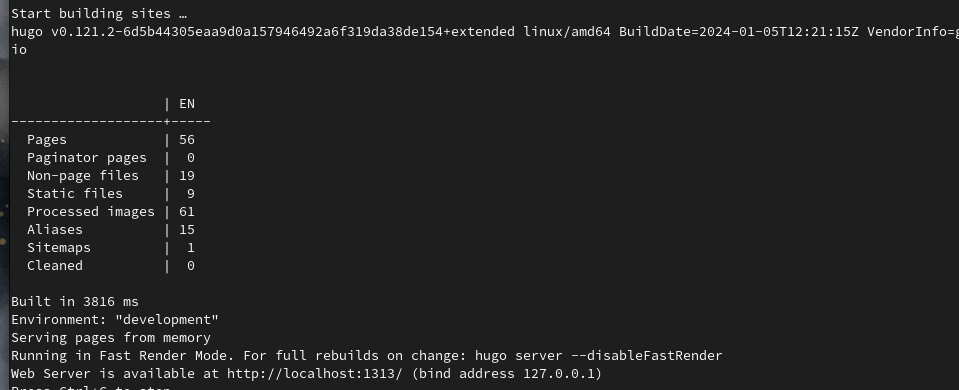

## Выполнение проекта

Захожу в каталог admin и редактирую файл _index.md, содержащий информацию о владельце страницы (рис.2)

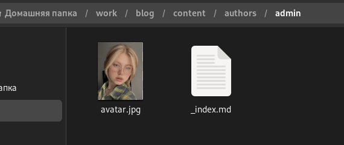{#fig:002 width=70%}

## Выполнение проекта

В блоке features, там, где заголовок Skills прописала навыки. Иконки для навыков искала, найдя в интернете официальную библиотеку иконок fas, так можно найти и иконки из библиотеки fab (рис.3)

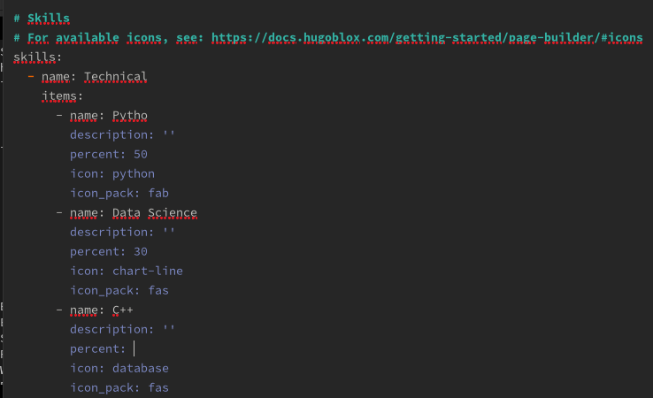{#fig:003 width=70%}

## Выполнение проекта

Вижу, что дизайн моего сайта был обновлен (рис.4)

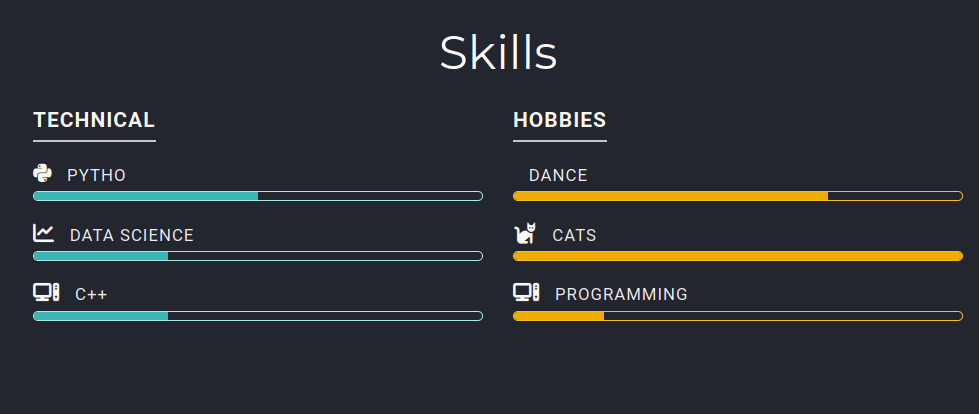{#fig:004 width=70%}

## Выполнение проекта

Перехожу в каталог сontent и редактирую файл _index.md (рис.5)

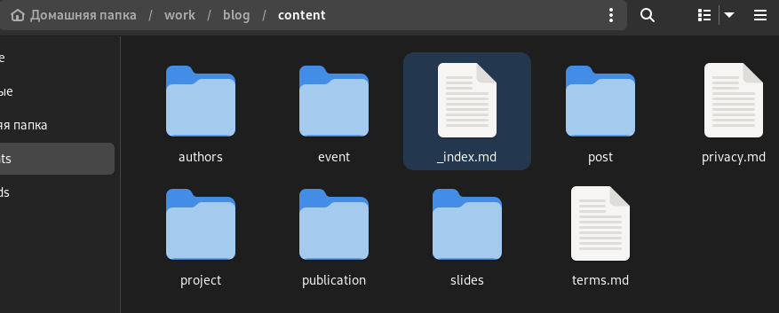{#fig:005 width=70%}

## Выполнение проекта

Редактирую информацию о своем опыте в файле (рис.6)

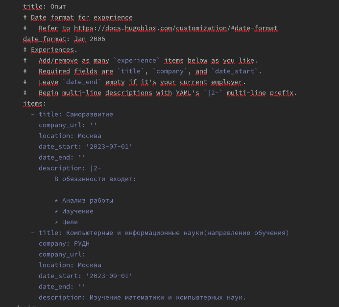{#fig:006 width=70%}

## Выполнение проекта

Смотрю на обновления на странице (рис.7)

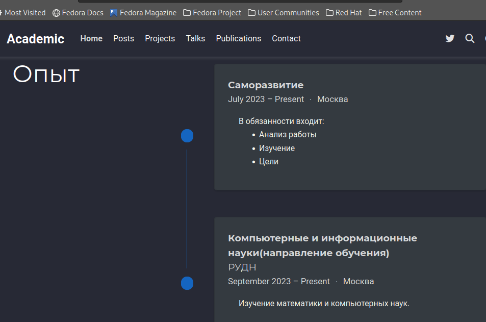{#fig:007 width=70%}

## Выполнение проекта

Далее в Accomplishments добавила достижения (рис.8)

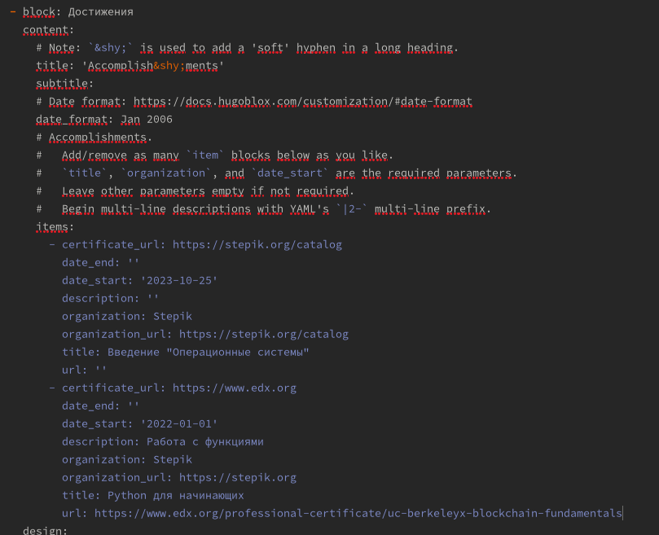{#fig:008 width=70%}

## Выполнение проекта

Смотрю на обновления на странице (рис.9)

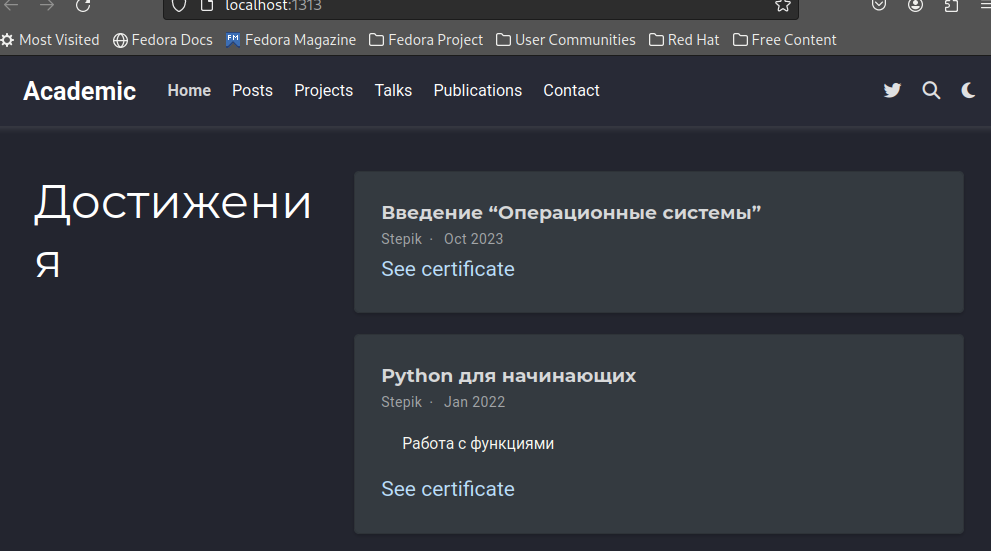{#fig:009 width=70%}

## Выполнение проекта

Создаю в каталоге сontent директорию post3 и копирую в данный каталог файл из каталога gettig-started (рис.10) 

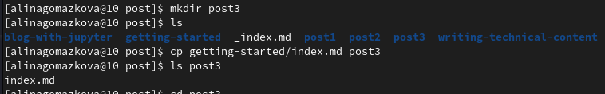{#fig:010 width=70%}

## Выполнение проекта

Добавила пост по прошедшей неделе(рис.11)

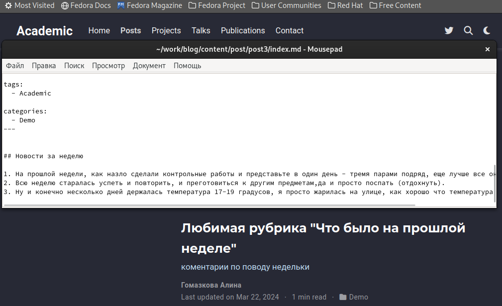{#fig:011 width=70%}

## Выполнение проекта

Захожу в каталог writing-technical-content и редактирую файл index.md (рис.12)

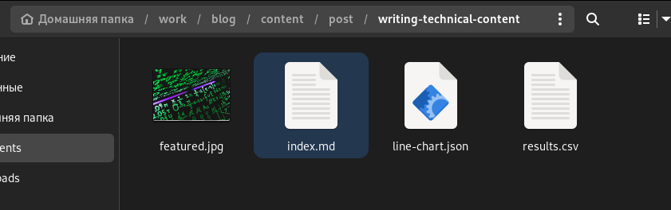{#fig:012 width=70%}

## Выполнение проекта

Добавила пост на тему по выбору (язык разметки Markdown) (рис.13)

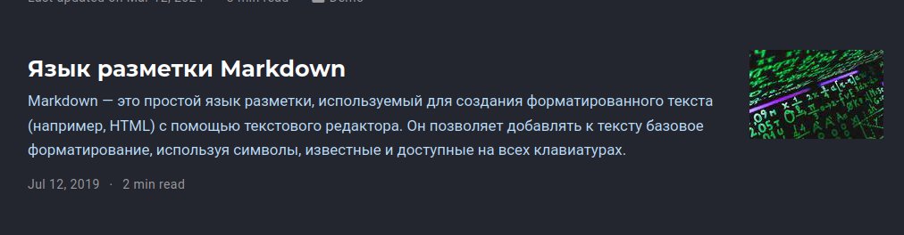{#fig:013 width=70%}

## Выполнение проекта

Закрываю локальный сервер с помощью клавиш Ctrl+C и собираю сайт с изменениями, введя команду ~/bin/hugo без аргументов (рис.14)

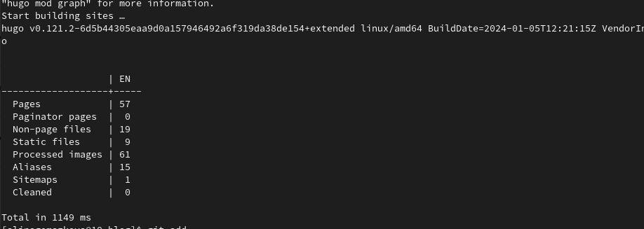{#fig:014 width=70%}

## Выполнение проекта

Отправляю изменения на GitHub (рис.15)

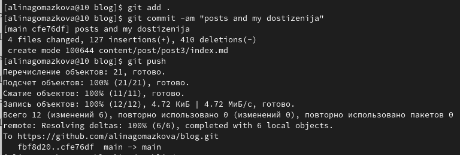{#fig:015 width=70%}

## Выполнение проекта

Теперь перехожу в директорию blog/public и отправляю изменения на GitHub, чтобы глобальный сайт тоже был обновлен (рис.16)

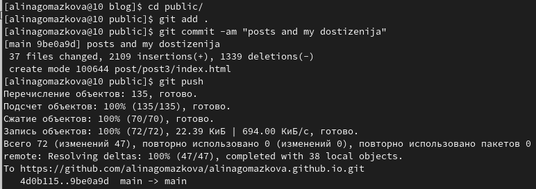{#fig:016 width=70%}

## Выполнение проекта

Проверяю, что все сделано корректно (рис.17)

{#fig:017 width=70%}

## Выводы

В процессе выполнения второго этапа индивидуального проекта я научилась редактировать данные о себе, а также писать посты и добавлять их на сайт.
