---
## Front matter
title: "Отчет по третьему этапу индивидуального проекта"
subtitle: "Операционные системы"
author: "Гомазкова Алина"

## Generic otions
lang: ru-RU
toc-title: "Содержание"

## Bibliography
bibliography: bib/cite.bib
csl: pandoc/csl/gost-r-7-0-5-2008-numeric.csl

## Pdf output format
toc: true # Table of contents
toc-depth: 2
lof: true # List of figures
lot: true # List of tables
fontsize: 12pt
linestretch: 1.5
papersize: a4
documentclass: scrreprt
## I18n polyglossia
polyglossia-lang:
  name: russian
  options:
	- spelling=modern
	- babelshorthands=true
polyglossia-otherlangs:
  name: english
## I18n babel
babel-lang: russian
babel-otherlangs: english
## Fonts
mainfont: PT Serif
romanfont: PT Serif
sansfont: PT Sans
monofont: PT Mono
mainfontoptions: Ligatures=TeX
romanfontoptions: Ligatures=TeX
sansfontoptions: Ligatures=TeX,Scale=MatchLowercase
monofontoptions: Scale=MatchLowercase,Scale=0.9
## Biblatex
biblatex: true
biblio-style: "gost-numeric"
biblatexoptions:
  - parentracker=true
  - backend=biber
  - hyperref=auto
  - language=auto
  - autolang=other*
  - citestyle=gost-numeric
## Pandoc-crossref LaTeX customization
figureTitle: "Рис."
tableTitle: "Таблица"
listingTitle: "Листинг"
lofTitle: "Список иллюстраций"
lotTitle: "Список таблиц"
lolTitle: "Листинги"
## Misc options
indent: true
header-includes:
  - \usepackage{indentfirst}
  - \usepackage{float} # keep figures where there are in the text
  - \floatplacement{figure}{H} # keep figures where there are in the text
---

# Цель работы

Продолжить работы со своим сайтом. Редактировать его в соответствии с требованиями. Добавить данные о своих достижениях.

# Задание

1. Добавить информацию о навыках (Skills).
2. Добавить информацию об опыте (Experience).
3. Добавить информацию о достижениях (Accomplishments).
4. Сделать пост по прошедшей неделе.
5. Добавить пост на тему по выбору.

# Теоретическое введение

Hugo — генератор статических страниц для интернета.

Что такое статические сайты
    1. Статические сайты состоят из уже готовых HTML-страниц.
    2. Эти страницы собираются заранее, а не готовятся для пользователя «на лету». Для этого используют генераторы статичных сайтов.
    3. Так как это почти чистый HTML, то такие сайты быстрее загружаются и их проще переносить с сервера на сервер.
    4. Минус: если нужно что-то обновить на странице, то сначала это правят в исходном файле, а потом запускают обновление в генераторе.
    5. Ещё минус: такие страницы не подходят для интернет-магазинов или сайтов с личным кабинетом, потому что в статике нельзя сформировать страницу для каждого отдельного пользователя.

# Выполнение лабораторной работы

Захожу в терминал, перехожу в директорию ~/work/blog, ввожу команду ~/bin/hugo server для запуска локального сервера (рис.1)

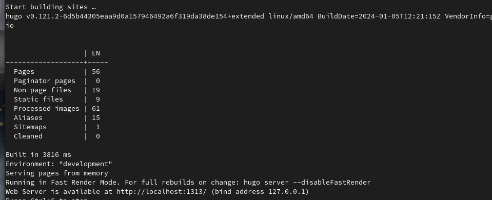{#fig:001 width=70%}

Захожу в каталог admin и редактирую файл _index.md, содержащий информацию о владельце страницы (рис.2)

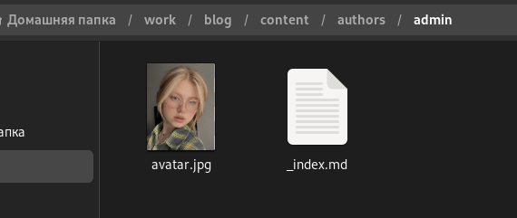{#fig:002 width=70%}

В блоке features, там, где заголовок Skills прописала навыки. Иконки для навыков искала, найдя в интернете официальную библиотеку иконок fas, так можно найти и иконки из библиотеки fab (рис.3)

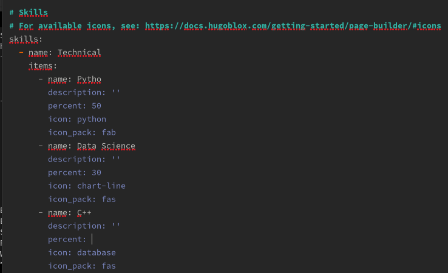{#fig:003 width=70%}

Вижу, что дизайн моего сайта был обновлен (рис.4)

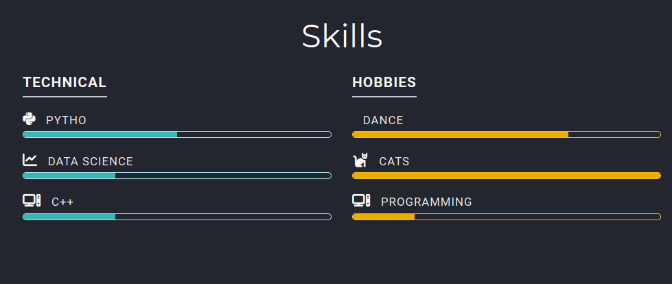{#fig:004 width=70%}

Перехожу в каталог сontent и редактирую файл _index.md (рис.5)

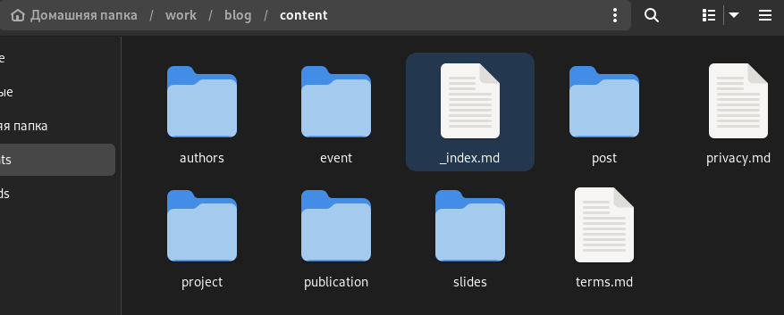{#fig:005 width=70%}

Редактирую информацию о своем опыте в файле (рис.6)

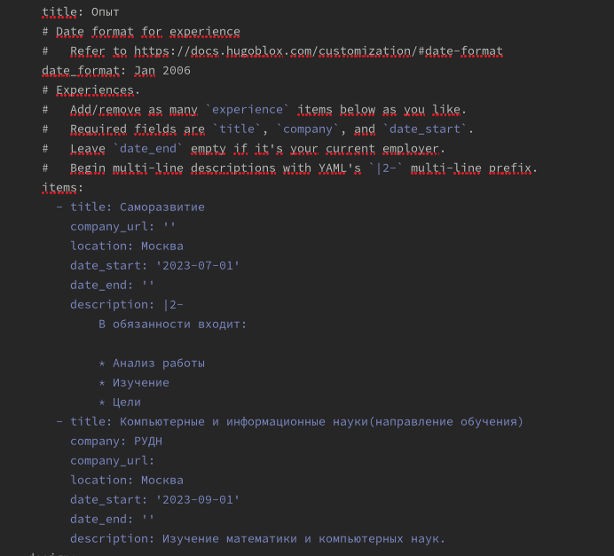{#fig:006 width=70%}

Смотрю на обновления на странице (рис.7)

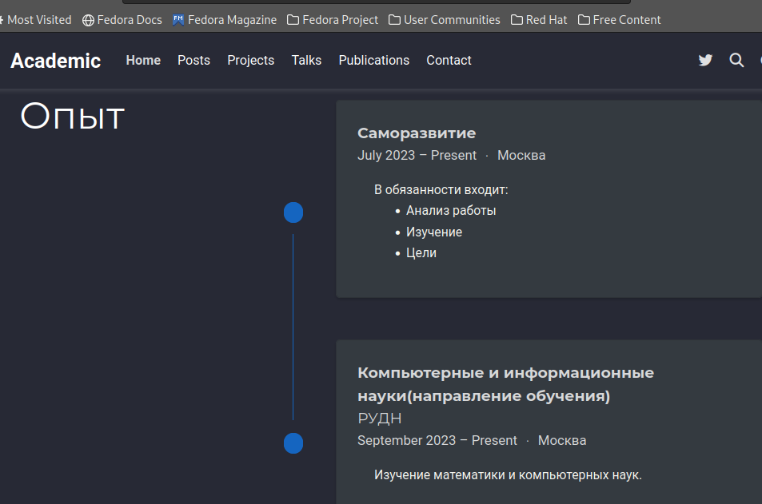{#fig:007 width=70%}

Далее в Accomplishments добавила достижения (рис.8)

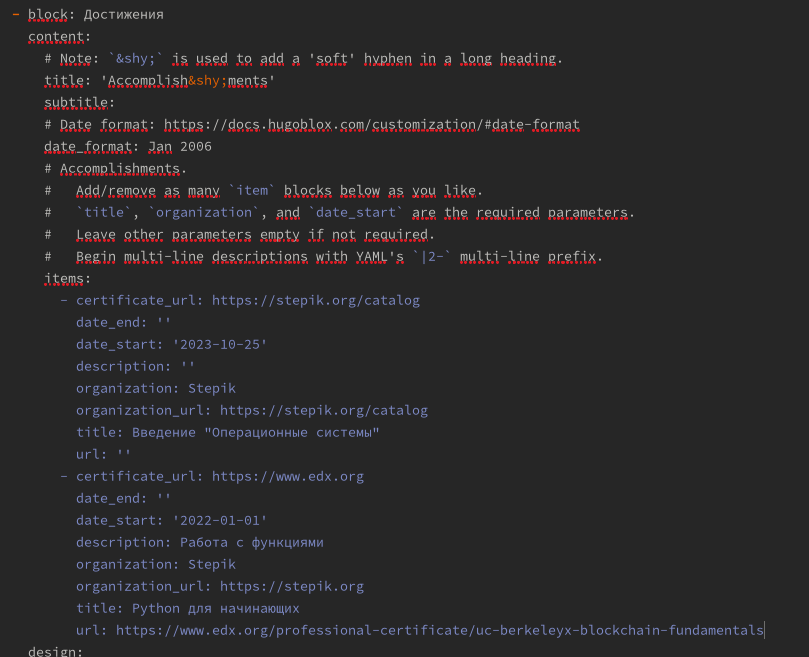{#fig:008 width=70%}

Смотрю на обновления на странице (рис.9)

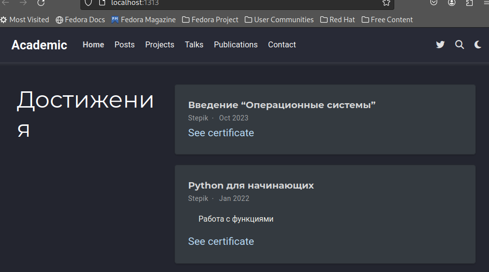{#fig:009 width=70%}

Создаю в каталоге сontent директорию post3 и копирую в данный каталог файл из каталога gettig-started (рис.10) 

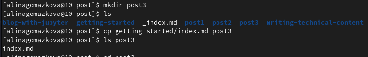{#fig:010 width=70%}

Добавила пост по прошедшей неделе(рис.11)

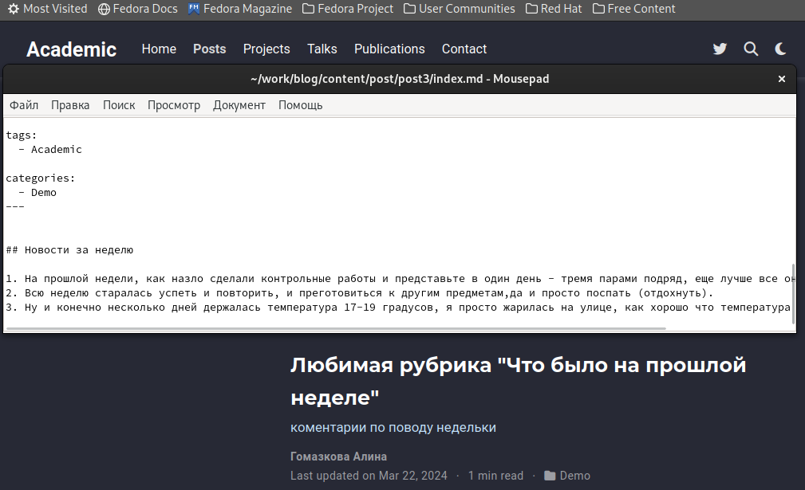{#fig:011 width=70%}

Захожу в каталог writing-technical-content и редактирую файл index.md (рис.12)

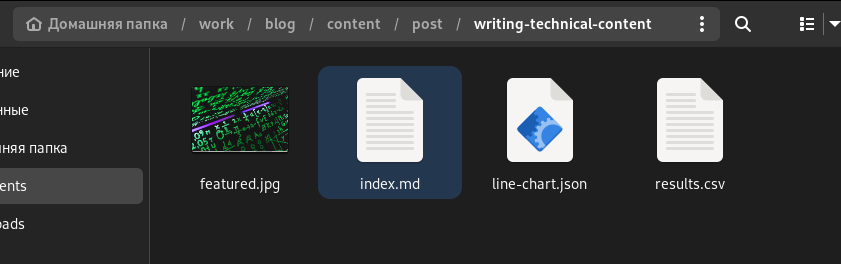{#fig:012 width=70%}

Добавила пост на тему по выбору (язык разметки Markdown) (рис.13)

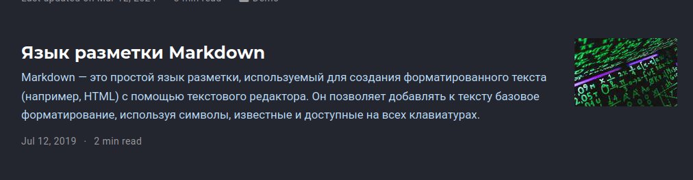{#fig:013 width=70%}

Закрываю локальный сервер с помощью клавиш Ctrl+C и собираю сайт с изменениями, введя команду ~/bin/hugo без аргументов (рис.14)

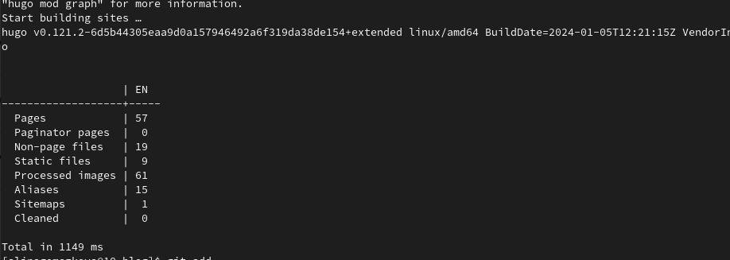{#fig:014 width=70%}

Отправляю изменения на GitHub (рис.15)

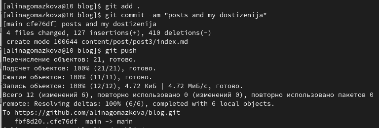{#fig:015 width=70%}

Теперь перехожу в директорию blog/public и отправляю изменения на GitHub, чтобы глобальный сайт тоже был обновлен (рис.16)

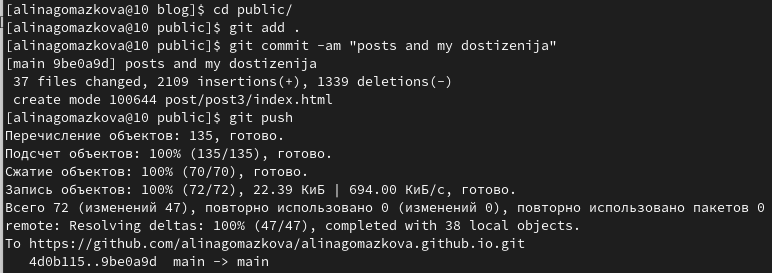{#fig:016 width=70%}

Проверяю, что все сделано корректно (рис.17)

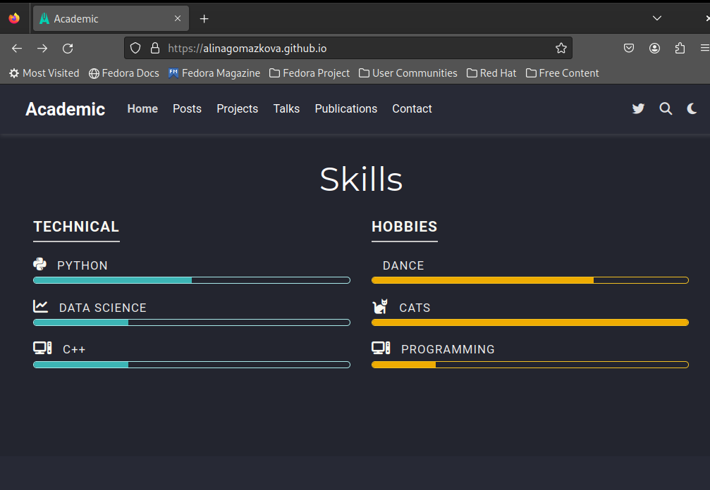{#fig:017 width=70%}

# Выводы

В процессе выполнения второго этапа индивидуального проекта я научилась редактировать данные о себе, а также писать посты и добавлять их на сайт.