---
## Front matter
title: "Отчёт по 4-ому этапу инд.проекта"
subtitle: "Операционные системы"
author: "Гомазкова Алина"

## Generic otions
lang: ru-RU
toc-title: "Содержание"

## Bibliography
bibliography: bib/cite.bib
csl: pandoc/csl/gost-r-7-0-5-2008-numeric.csl

## Pdf output format
toc: true # Table of contents
toc-depth: 2
lof: true # List of figures
lot: true # List of tables
fontsize: 12pt
linestretch: 1.5
papersize: a4
documentclass: scrreprt
## I18n polyglossia
polyglossia-lang:
  name: russian
  options:
	- spelling=modern
	- babelshorthands=true
polyglossia-otherlangs:
  name: english
## I18n babel
babel-lang: russian
babel-otherlangs: english
## Fonts
mainfont: PT Serif
romanfont: PT Serif
sansfont: PT Sans
monofont: PT Mono
mainfontoptions: Ligatures=TeX
romanfontoptions: Ligatures=TeX
sansfontoptions: Ligatures=TeX,Scale=MatchLowercase
monofontoptions: Scale=MatchLowercase,Scale=0.9
## Biblatex
biblatex: true
biblio-style: "gost-numeric"
biblatexoptions:
  - parentracker=true
  - backend=biber
  - hyperref=auto
  - language=auto
  - autolang=other*
  - citestyle=gost-numeric
## Pandoc-crossref LaTeX customization
figureTitle: "Рис."
tableTitle: "Таблица"
listingTitle: "Листинг"
lofTitle: "Список иллюстраций"
lotTitle: "Список таблиц"
lolTitle: "Листинги"
## Misc options
indent: true
header-includes:
  - \usepackage{indentfirst}
  - \usepackage{float} # keep figures where there are in the text
  - \floatplacement{figure}{H} # keep figures where there are in the text
---

# Цель работы

Добавить ссылки на сторонние профили или полезные источники, написать посты.

# Задание

1. Зарегистрироваться на соответствующих ресурсах и разместить на них ссылки на сайте:
 
eLibrary : https://elibrary.ru/;

Google Scholar : https://scholar.google.com/;

ORCID : https://orcid.org/;

Mendeley : https://www.mendeley.com/;
        
ResearchGate : https://www.researchgate.net/;

Academia.edu : https://www.academia.edu/;

arXiv : https://arxiv.org/;

github : https://github.com/.

2. Сделать пост по прошедшей неделе.

3. Добавить пост на тему по выбору:

Оформление отчёта.

Создание презентаций.

Работа с библиографией.

# Выполнение лабораторной работы

Регистрируюсь на e-library.ru (рис.1).

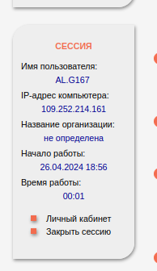{#fig:001 width=70%}

Регистрируюсь на Google Scholar  (рис.2)

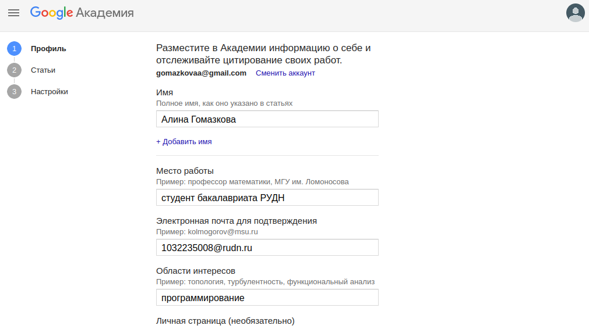{#fig:002 width=70%}

Регистрируюсь на ORCID  (рис.3)

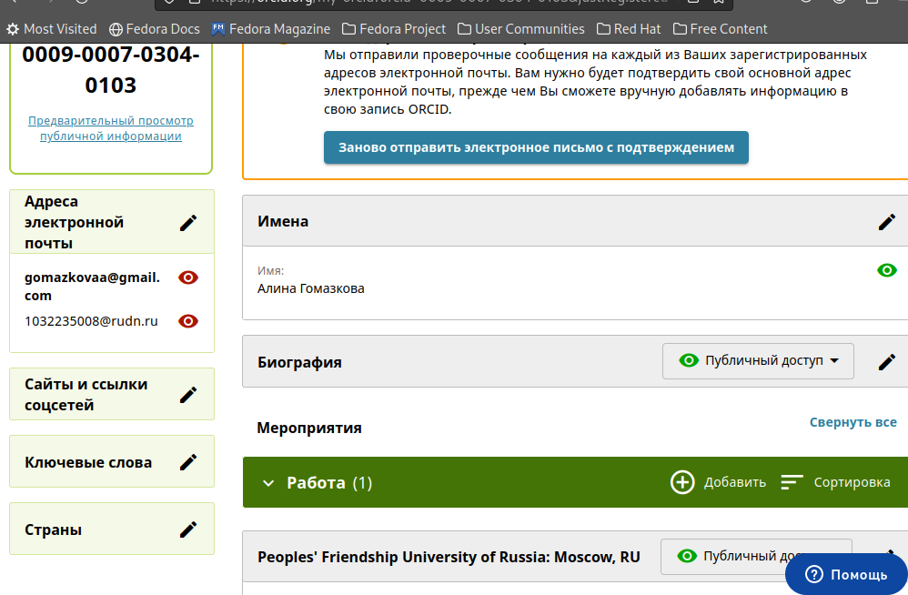{#fig:003 width=70%}

Регистрируюсь на Mendeley (рис.4)

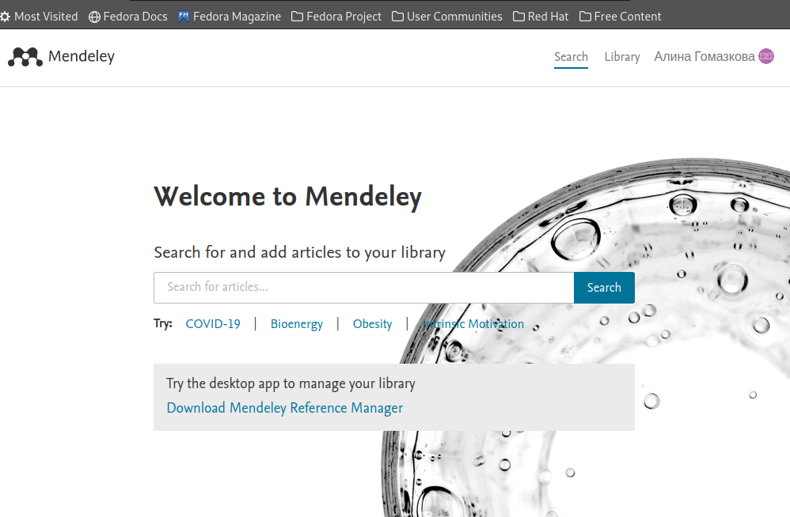{#fig:004 width=70%}

Регистрируюсь на Academia.edu (рис.5)

{#fig:005 width=70%}

Регистрируюсь на arXiv (рис.6)

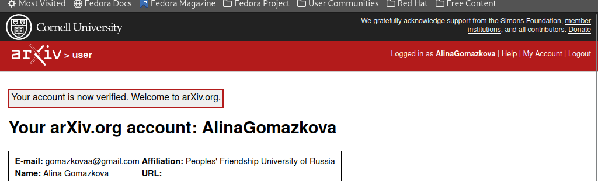{#fig:006 width=70%}

У меня уже есть аккаунт на github (рис.7)

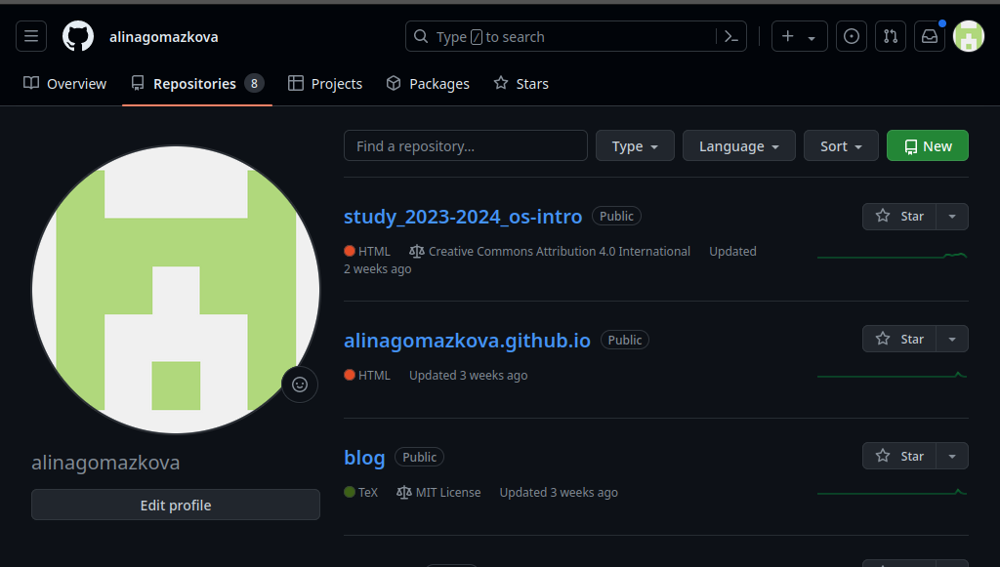{#fig:007 width=70%}

Вставляю ссылки на сайт (рис.8)

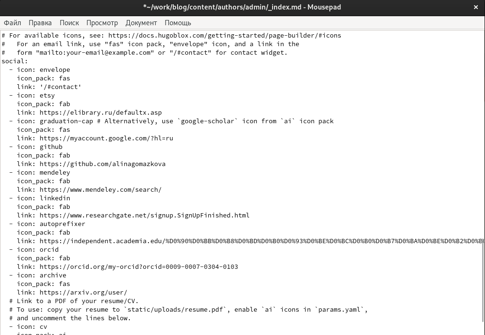{#fig:008 width=70%}

Пишу пост о прошедшей неделе (рис.9)

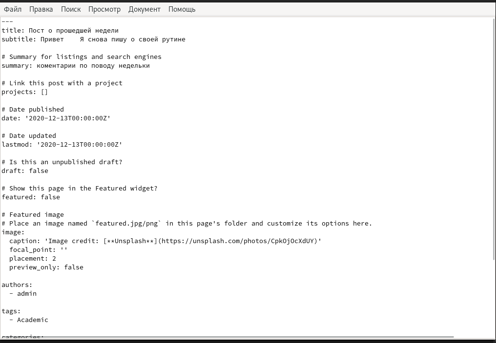{#fig:009 width=70%}

Пишу пост на тему создания презентации (рис.10)

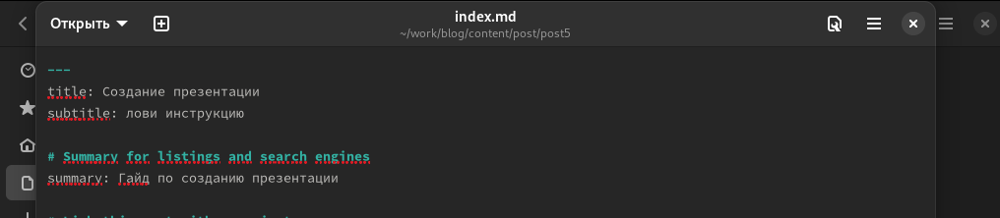{#fig:010 width=70%}

Вижу, что посты были успешно опубликованы (рис.11)

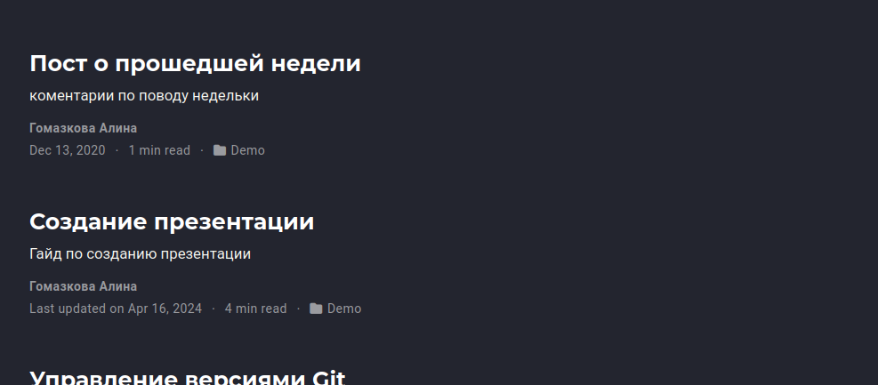{#fig:011 width=70%}

Выкладываю измения в гитхаб (рис.12)

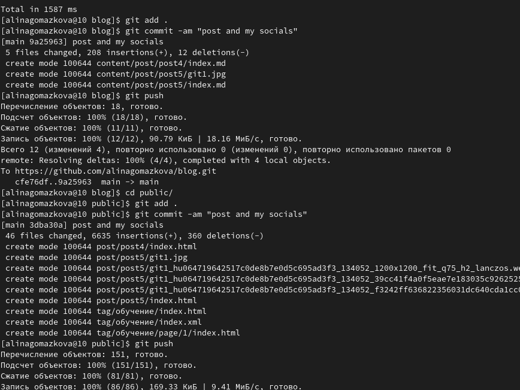{#fig:012 width=70%}

Проверяю изменения на сайте (рис.13)

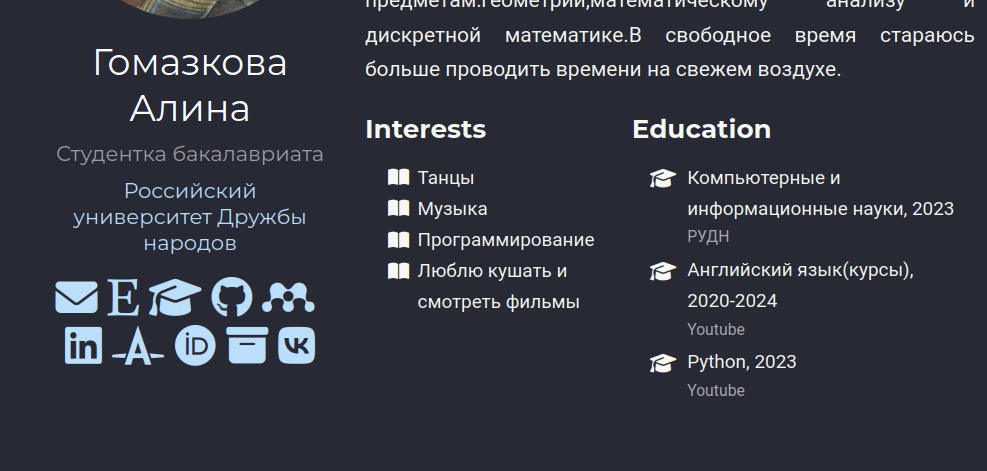{#fig:013 width=70%}

# Выводы

Здесь кратко описываются итоги проделанной работы.
