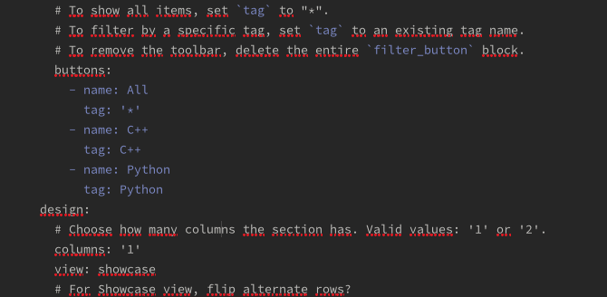
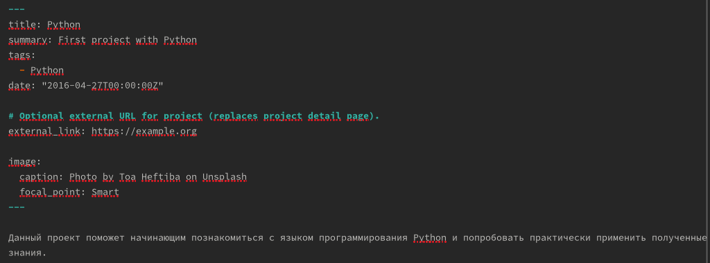
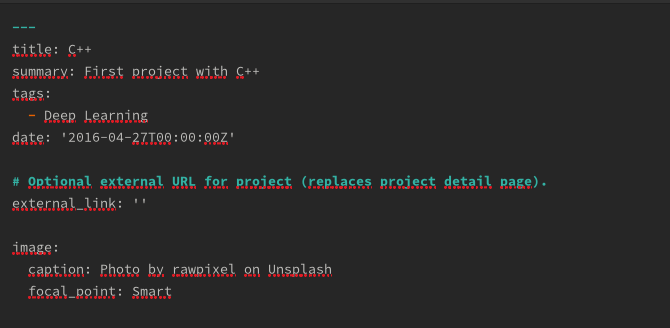
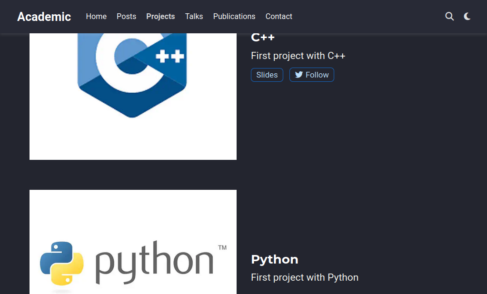
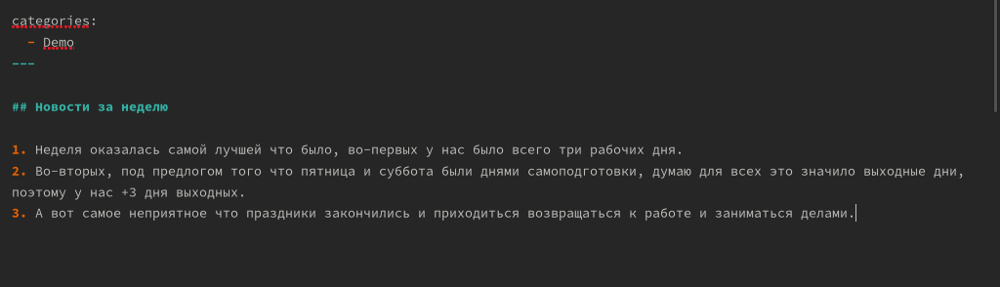
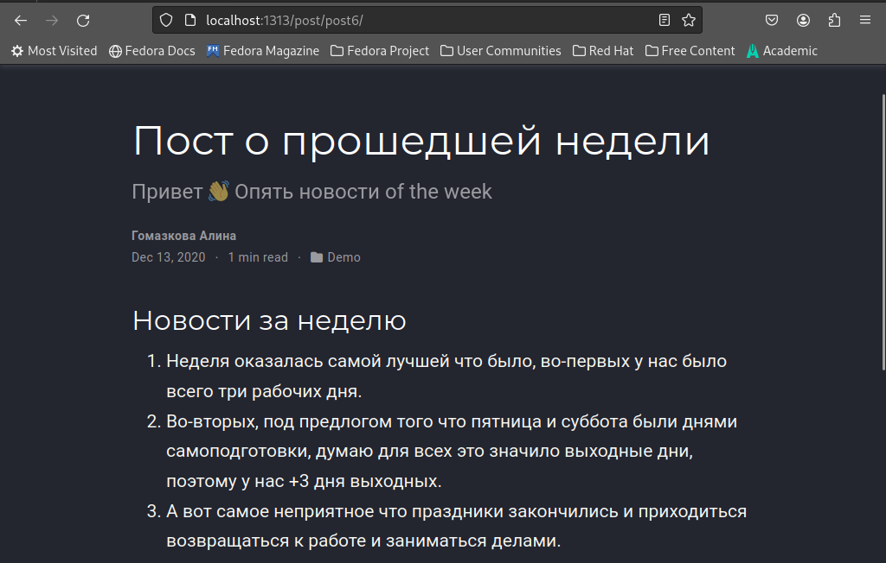
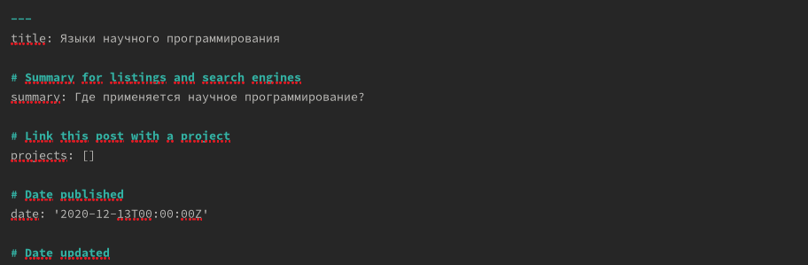
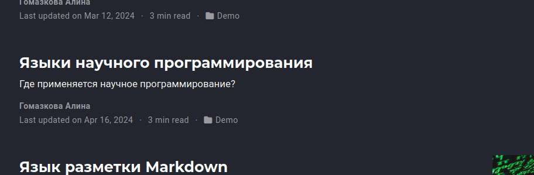

---
## Front matter
lang: ru-RU
title: Презентация по 5-ому этапу индивидуального проекта
subtitle: Операционные системы
author:
  - Гомазкова А.
institute:
  - Российский университет дружбы народов, Москва, Россия

## i18n babel
babel-lang: russian
babel-otherlangs: english

## Formatting pdf
toc: false
toc-title: Содержание
slide_level: 2
aspectratio: 169
section-titles: true
theme: metropolis
header-includes:
 - \metroset{progressbar=frametitle,sectionpage=progressbar,numbering=fraction}
 - '\makeatletter'
 - '\beamer@ignorenonframefalse'
 - '\makeatother'
---

# Информация

## Докладчик

:::::::::::::: {.columns align=center}
::: {.column width="70%"}

  * Гомазкова Алина
  * студентка из группы НКАбд-02-23
  * Факультет физико-математических и естественных наук
  * Российский университет дружбы народов
  * [1032235008@rudn.ru](mailto:1032235008@rudn.ru)
  * <https://alinagomazkova.github.io>

:::
::::::::::::::

# Вводная часть

## Актуальность

Проекты дают представление о практическом опыте научного сотрудника.

## Цели и задачи

Загрузить на сайт инофрмацию о проектах, написать тематические посты

## Материалы и методы

1. Сделать записи для персональных проектов.
2. Сделать пост по прошедшей неделе.
3. Добавить пост на тему по выбору: языки научного программирования.

## Выполнение работы

Сначала меняю теги и названия категорий для своих проектов. (рис.1).

{#fig:001 width=70%}

## Выполнение работы

Затем я меняю описание и тег для проекта по С++. (рис.2)

{#fig:002 width=70%}

## Выполнение работы

Меняю описание и оформление проекта по Python. (рис.3)

{#fig:003 width=70%}

## Выполнение работы

Вижу, что информация о проектах была успешно обновлена. (рис.4)

{#fig:004 width=70%}

## Выполнение работы

Пишу пост о прошедшей неделе.  (рис.5)

{#fig:005 width=70%}

## Выполнение работы

Вижу, что пост появился на сайте. (рис.6)

{#fig:006 width=70%}

## Выполнение работы

Пишу пост на тему языков научного программирования  (рис.7)

{#fig:007 width=70%}

## Выполнение работы

Вижу, что пост был опубликован на сайте. (рис.8)

{#fig:008 width=70%}

## Результаты

Я загрузила на сайт инофрмацию о проектах, написала тематические посты
