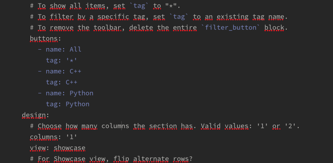
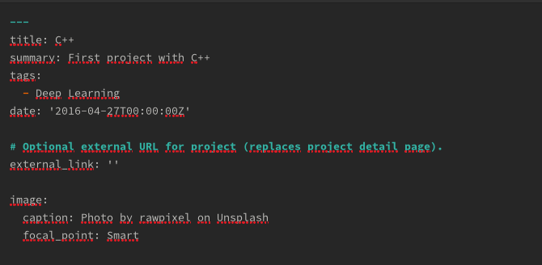
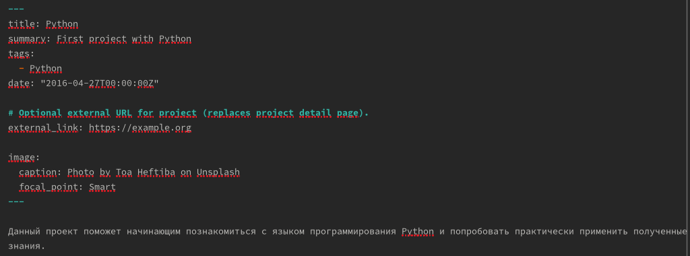
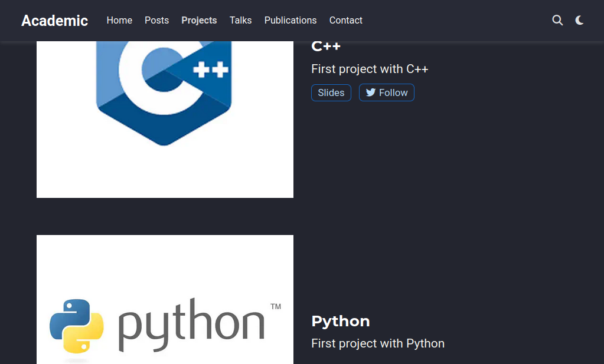
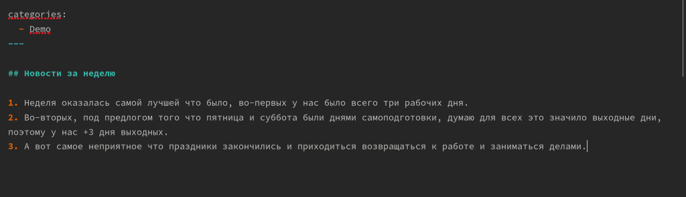
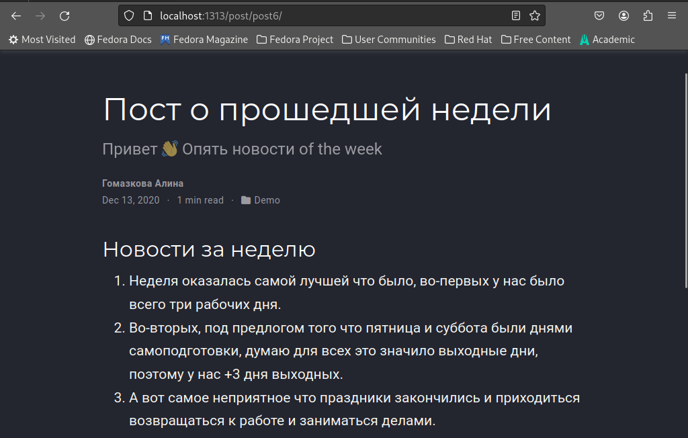
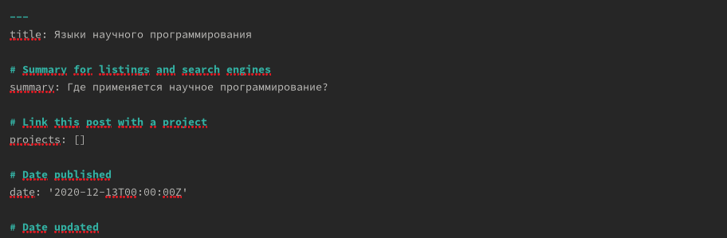
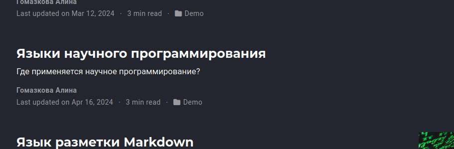

---
## Front matter
title: "Отчёт по 5-ому этапу инд.проекта"
subtitle: "Операционные системы"
author: "Гомазкова Алина"

## Generic otions
lang: ru-RU
toc-title: "Содержание"

## Bibliography
bibliography: bib/cite.bib
csl: pandoc/csl/gost-r-7-0-5-2008-numeric.csl

## Pdf output format
toc: true # Table of contents
toc-depth: 2
lof: true # List of figures
lot: true # List of tables
fontsize: 12pt
linestretch: 1.5
papersize: a4
documentclass: scrreprt
## I18n polyglossia
polyglossia-lang:
  name: russian
  options:
	- spelling=modern
	- babelshorthands=true
polyglossia-otherlangs:
  name: english
## I18n babel
babel-lang: russian
babel-otherlangs: english
## Fonts
mainfont: PT Serif
romanfont: PT Serif
sansfont: PT Sans
monofont: PT Mono
mainfontoptions: Ligatures=TeX
romanfontoptions: Ligatures=TeX
sansfontoptions: Ligatures=TeX,Scale=MatchLowercase
monofontoptions: Scale=MatchLowercase,Scale=0.9
## Biblatex
biblatex: true
biblio-style: "gost-numeric"
biblatexoptions:
  - parentracker=true
  - backend=biber
  - hyperref=auto
  - language=auto
  - autolang=other*
  - citestyle=gost-numeric
## Pandoc-crossref LaTeX customization
figureTitle: "Рис."
tableTitle: "Таблица"
listingTitle: "Листинг"
lofTitle: "Список иллюстраций"
lotTitle: "Список таблиц"
lolTitle: "Листинги"
## Misc options
indent: true
header-includes:
  - \usepackage{indentfirst}
  - \usepackage{float} # keep figures where there are in the text
  - \floatplacement{figure}{H} # keep figures where there are in the text
---

# Цель работы

Загрузить на сайт инофрмацию о проектах, написать тематические посты

# Задание

1. Сделать записи для персональных проектов.
2. Сделать пост по прошедшей неделе.
3. Добавить пост на тему по выбору: языки научного программирования.

# Выполнение работы

Сначала меняю теги и названия категорий для своих проектов. (рис.1).

{#fig:001 width=70%}

Затем я меняю описание и тег для проекта по С++. (рис.2)

{#fig:002 width=70%}

Меняю описание и оформление проекта по Python. (рис.3)

{#fig:003 width=70%}

Вижу, что информация о проектах была успешно обновлена. (рис.4)

{#fig:004 width=70%}

Пишу пост о прошедшей неделе.  (рис.5)

{#fig:005 width=70%}

Вижу, что пост появился на сайте. (рис.6)

{#fig:006 width=70%}

Пишу пост на тему языков научного программирования  (рис.7)

{#fig:007 width=70%}

Вижу, что пост был опубликован на сайте. (рис.8)

{#fig:008 width=70%}

# Выводы

Я загрузила на сайт инофрмацию о проектах, написала тематические посты